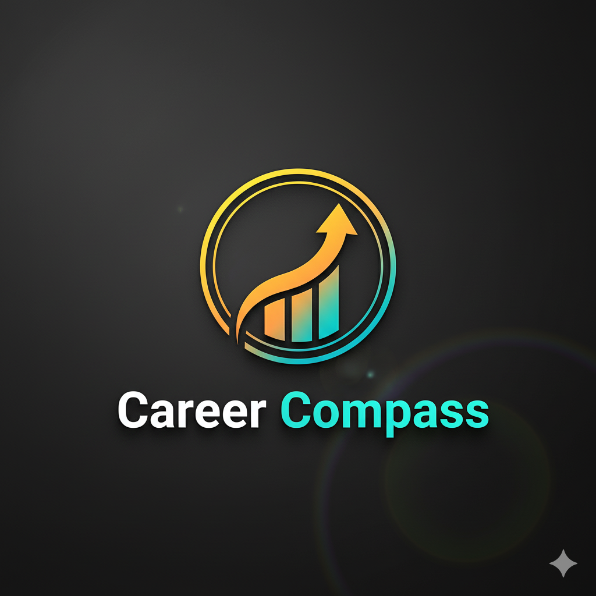
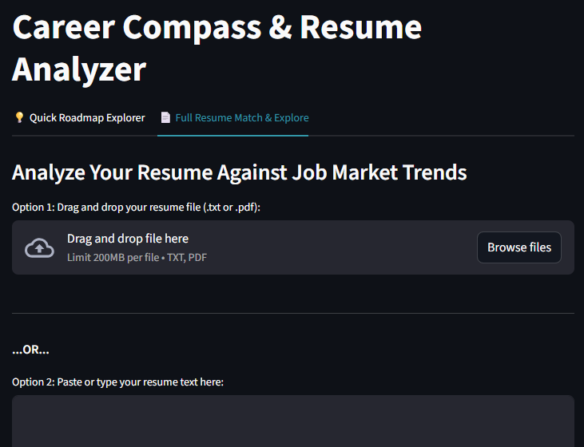

# Career Compass & Resume Analyzer

<div align="center">
   
</div>


[](https://www.python.org/downloads/)
[](https://streamlit.io/)
[](https://opensource.org/licenses/MIT)
[](https://www.linkedin.com/in/kory-karp-1a7a1b75/)

An AI-powered career guidance tool that helps job seekers explore career paths, analyze their resumes, and generate personalized career roadmaps using Google's Gemini API.



## 🌟 Features

### 💡 Quick Roadmap Explorer
- Generate instant career roadmaps for any job title
- No resume required - perfect for exploring new career paths
- Get structured phase-by-phase guidance with skills, credentials, and project recommendations

### 📄 Full Resume Match & Explore
- Upload your resume (PDF or TXT) or paste it directly
- AI-powered job recommendations based on your background
- Keyword extraction and analysis
- Skills gap analysis with progress tracking
- Compare your resume against required skills for target roles

### 📊 Interactive Features
- Collapsible phase-by-phase roadmap view
- Skills coverage checklist (✅/❌)
- Progress bar showing skill alignment
- Export roadmaps as TXT or PDF
- Clean, intuitive Streamlit interface

---

## 📋 Table of Contents

- [Installation](#installation)
- [Usage](#usage)
- [Features in Detail](#features-in-detail)
- [Architecture](#architecture)
- [Configuration](#configuration)
- [API Reference](#api-reference)
- [Troubleshooting](#troubleshooting)
- [Contributing](#contributing)
- [License](#license)

---

## 🚀 Installation

### Prerequisites

- Python 3.8 or higher
- pip package manager
- Google API Key for Gemini ([Get one here](https://ai.google.dev/))

### Quick Start

1. **Clone the repository:**
   ```bash
   git clone https://github.com/kosmickroma/career-compass.git
   cd career-compass
   ```

2. **Create a virtual environment (recommended):**
   ```bash
   # Windows
   python -m venv venv
   venv\Scripts\activate

   # macOS/Linux
   python3 -m venv venv
   source venv/bin/activate
   ```

3. **Install dependencies:**
   ```bash
   pip install -r requirements.txt
   ```

4. **Set up your Google API key:**
   
   **Option A - Environment Variable:**
   ```bash
   # Windows (Command Prompt)
   set GOOGLE_API_KEY=your_api_key_here
   
   # Windows (PowerShell)
   $env:GOOGLE_API_KEY="your_api_key_here"
   
   # macOS/Linux
   export GOOGLE_API_KEY='your_api_key_here'
   ```
   
   **Option B - .env file (recommended):**
   ```bash
   # Create a .env file in the project root
   echo "GOOGLE_API_KEY=your_api_key_here" > .env
   ```

5. **Run the application:**
   ```bash
   streamlit run resume_analyzer.py
   ```

The app will automatically open in your browser at `http://localhost:8501`

### Dependencies

Create a `requirements.txt` file with:

```txt
streamlit>=1.28.0
requests>=2.31.0
pypdf>=3.17.0
reportlab>=4.0.0
```

---

## 💻 Usage

### Quick Roadmap Explorer

1. Navigate to the **"💡 Quick Roadmap Explorer"** tab
2. Enter your desired job title (e.g., "Data Scientist", "Product Manager")
3. Click **"Generate Goal Roadmap"** or press `Enter`
4. View your personalized career roadmap with phases, skills, and milestones
5. Download the roadmap as TXT or PDF

**Example:**
```
Input: "Machine Learning Engineer"
Output: Structured roadmap with phases covering:
  - Phase 1: Foundational Skills
  - Phase 2: Technical Expertise
  - Phase 3: Portfolio Development
  - Phase 4: Job Market Preparation
```

### Resume Analysis Workflow

1. Navigate to the **"📄 Full Resume Match & Explore"** tab
2. **Upload your resume:**
   - **Option 1**: Drag and drop a PDF or TXT file
   - **Option 2**: Paste your resume text directly into the text area
3. Click **"Analyze Resume"** or press `Enter`
4. Review extracted keywords and AI-generated job recommendations
5. Select a job title from the dropdown menu
6. View skills gap analysis showing which required skills you have
7. Generate a detailed career roadmap for your selected role
8. Download your roadmap in TXT or PDF format

**Supported File Formats:**
- `.txt` - Plain text files
- `.pdf` - PDF documents (text-based only, not scanned images)

---

## 🔍 Features in Detail

### Keyword Analysis
The tool extracts meaningful keywords from your resume, filtering out common stop words to focus on technical skills, tools, and relevant experience.

**How it works:**
- Tokenizes resume text into individual words
- Removes stop words (e.g., "the", "and", "or")
- Identifies skills, technologies, and relevant terms
- Matches against job requirements

### AI-Powered Recommendations
Uses Google's **Gemini 2.5 Flash** model to:
- ✅ Analyze resume content and suggest matching career paths
- ✅ Generate comprehensive career roadmaps
- ✅ Identify top required skills for specific roles
- ✅ Provide personalized career guidance

### Skills Gap Analysis
- Fetches top 10 required skills for any job title
- Compares against your resume content
- Provides visual progress tracking (e.g., 7/10 skills covered)
- Shows a detailed checklist: ✅ = covered, ❌ = missing

**Example Output:**
```
You've got 7/10 recommended skills covered for Data Scientist
[Progress Bar: 70%]

✅ Python
✅ Machine Learning
✅ Statistics
✅ SQL
❌ TensorFlow
✅ Data Visualization
❌ Deep Learning
✅ Pandas
✅ Numpy
❌ Cloud Platforms
```

### Export Options
- **TXT Format**: Plain text download for easy editing and sharing
- **PDF Format**: Professional formatting with:
  - Title page with job title
  - Formatted headers and sections
  - Bullet points and lists
  - Proper spacing and margins
  - Footer attribution

---

## 🏗️ Architecture

### Project Structure

```
career-compass/
│
├── resume_analyzer.py       # Main application file
├── requirements.txt          # Python dependencies
├── README.md                 # This file
├── .env                      # Environment variables (not tracked)
├── .gitignore               # Git ignore file
│
└── assets/                   # Optional: screenshots, demos
    └── demo.gif
```

### Core Components

| Function | Purpose |
|----------|---------|
| `call_gemini_withspinner()` | Handles API calls to Gemini with visual spinner feedback |
| `generate_career_recommendations()` | Analyzes resume-job keyword matching |
| `recommend_jobs()` | Gets AI-powered job title suggestions |
| `generate_roadmap()` | Creates structured career development plans |
| `get_required_skills_for_job()` | Fetches skills needed for specific roles |
| `skill_covered()` | Checks if resume demonstrates required skills |
| `generate_pdf()` | Creates formatted PDF exports using ReportLab |

### Session State Management
Uses Streamlit's session state to maintain:
- Resume analysis results
- Job recommendations  
- Generated roadmaps
- User inputs across reruns
- Cached skills data for performance

---

## ⚙️ Configuration

### API Settings

Configure in the code (default values):
```python
model = "gemini-2.5-flash"    # Gemini model version
timeout = 60                   # API timeout in seconds
n_skills = 10                  # Number of skills to analyze
```

### Customization Options

**Stop Words:**
Modify the `STOP_WORDS` set to customize keyword filtering:
```python
STOP_WORDS = {
    "a", "an", "at", "for", "from", "the", "and", ...
}
```

**Number of Job Recommendations:**
Change in the AI prompt (default: 5):
```python
ai_prompt = "...recommend 5 job titles..."  # Change 5 to your preferred number
```

**PDF Styling:**
Customize in `generate_pdf()` function:
- Page size (default: letter)
- Margins
- Font styles
- Colors and formatting

---

## 📚 API Reference

### Environment Variables

| Variable | Required | Description |
|----------|----------|-------------|
| `GOOGLE_API_KEY` | Yes* | Your Google Gemini API key |

*Required for AI features. App runs in dry-run mode without it.

### Gemini API Endpoints

The application uses:
```
https://generativelanguage.googleapis.com/v1beta/models/{model}:generateContent
```

**Rate Limits:** Subject to your Google API quota

---

## 🐛 Troubleshooting

### Common Issues

#### ❌ "No GOOGLE_API_KEY found"
**Solution:**
- Ensure your API key is set as an environment variable
- Check `.env` file exists and contains the key
- Restart your terminal/IDE after setting environment variables
- Note: App runs in dry-run mode without a key (prints prompts but doesn't generate content)

#### ❌ Resume not parsing correctly
**Solutions:**
- Try a different file format (PDF → TXT or vice versa)
- Ensure PDF is text-based, not scanned images
- Check for special characters or encoding issues
- Try copying and pasting text directly instead of uploading

#### ❌ Skills not matching
**Why this happens:**
- The tool uses fuzzy matching and tokenization
- Abbreviations may not match (e.g., "JS" vs "JavaScript")

**Solutions:**
- Ensure resume uses industry-standard terminology
- Spell out abbreviations where possible
- Include both abbreviated and full terms

#### ❌ Streamlit errors
**Common fixes:**
```bash
# Clear Streamlit cache
streamlit cache clear

# Update Streamlit
pip install --upgrade streamlit

# Check Python version
python --version  # Should be 3.8+
```

### Getting Help

- 🐛 [Open an issue](https://github.com/kosmickroma/career-compass/issues)
- 💬 [Discussions](https://github.com/kosmickroma/career-compass/discussions)
- 📧 Email: kosmickroma@gmail.com

---

## 🤝 Contributing

Contributions are welcome! Here's how you can help:

### Reporting Bugs
1. Check if the bug has already been reported in [Issues](https://github.com/kosmickroma/career-compass/issues)
2. If not, create a new issue with:
   - Clear description of the bug
   - Steps to reproduce
   - Expected vs actual behavior
   - Screenshots (if applicable)

### Suggesting Features
1. Open a [Feature Request](https://github.com/kosmickroma/career-compass/issues/new?labels=enhancement)
2. Describe the feature and why it would be useful
3. Include examples if possible

### Pull Requests
1. Fork the repository
2. Create a new branch (`git checkout -b feature/AmazingFeature`)
3. Make your changes
4. Commit your changes (`git commit -m 'Add some AmazingFeature'`)
5. Push to the branch (`git push origin feature/AmazingFeature`)
6. Open a Pull Request

### Development Setup
```bash
# Clone your fork
git clone https://github.com/kosmickroma/career-compass.git

# Create a branch
git checkout -b feature/your-feature-name

# Make changes and test
streamlit run resume_analyzer.py

# Commit and push
git add .
git commit -m "Description of changes"
git push origin feature/your-feature-name
```

---

## 📄 License

This project is licensed under the MIT License - see the [LICENSE](LICENSE) file for details.

```
MIT License

Copyright (c) 2025 [Kory R Karp]

Permission is hereby granted, free of charge, to any person obtaining a copy
of this software and associated documentation files (the "Software"), to deal
in the Software without restriction...
```

---

## 🙏 Acknowledgments

Built with amazing open-source tools:

- [Streamlit](https://streamlit.io/) - The fastest way to build data apps
- [Google Gemini API](https://ai.google.dev/) - Powerful AI capabilities
- [ReportLab](https://www.reportlab.com/) - PDF generation
- [PyPDF](https://pypdf.readthedocs.io/) - PDF parsing

**Special Thanks:**
- The Streamlit community for excellent documentation
- Google AI team for the Gemini API
- All contributors and users of this project

---

## 📞 Contact & Links

- **Author**: [Kory R Karp](https://github.com/kosmickroma)
- **Project Link**: [https://github.com/kosmickroma/career-compass](https://github.com/kosmickroma/career-compass)
- **Live Demo**: [https://ai-career-plan-vcexjqbtlfgdnj8kg8b8ps.streamlit.app/]
- **LinkedIn**: [https://www.linkedin.com/in/kory-karp-1a7a1b75/]
- **Email**: kosmickroma@gmail.com
- **Documentation**: [Wiki](https://github.com/kosmickroma/career-compass/wiki)

---

## ⚠️ Disclaimer

This tool provides AI-generated suggestions for **educational and informational purposes only**. 

- Always verify recommendations with professional career counselors
- Conduct your own research when making career decisions
- AI suggestions should complement, not replace, professional advice
- Your privacy: We don't store or share your resume data

---

<div align="center">

**Made with ❤️ by [Kory R Karp]**

⭐ Star this repo if you find it helpful!

[Report Bug](https://github.com/yourusername/career-compass/issues) · [Request Feature](https://github.com/yourusername/career-compass/issues) · [Documentation](https://github.com/yourusername/career-compass/wiki)

</div>